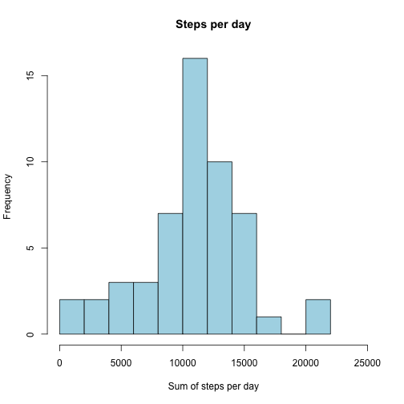
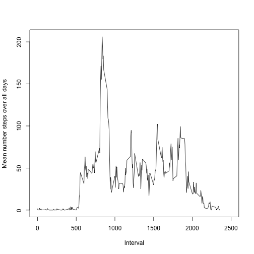
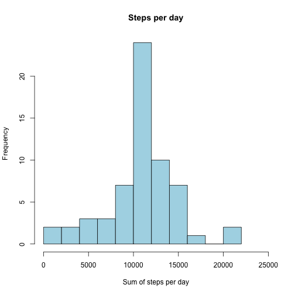
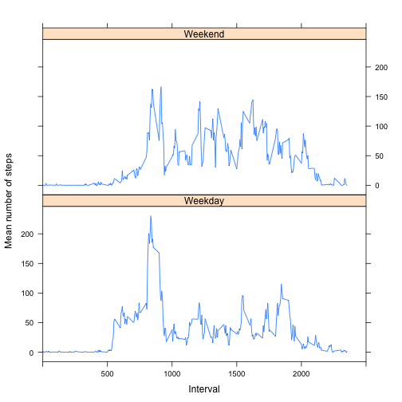

# Introduction
This markdownfile is made for the assignment in the Reproducible Research course. This course is a part of the Datascience track on Coursera. 
In this assignment de dplyr and the lattice package will be used and loaded automatically, but you have to have them  installed already.

```r
library("dplyr")
```

```
## 
## Attaching package: 'dplyr'
## 
## The following object is masked from 'package:stats':
## 
##     filter
## 
## The following objects are masked from 'package:base':
## 
##     intersect, setdiff, setequal, union
```

```r
library("lattice")
```

  
## Loading and preprocessing the data
First check whether "activity.csv"exists in the working directory.  
Then read the data into a dataframe called "Data"

```r
if (!file.exists("activity.csv")){
      print("Download activity.csv in your working directory")
}
Data<-read.csv("activity.csv")
```
  
  
## What is mean total number of steps taken per day?
First group the Data by day and then calculate the total number of steps per day.

```r
DataDay<-group_by(Data, date)
SumStepsDay<-summarise_each(DataDay,funs(sum), -interval)
```
A histogram of the total number of steps taken each day looks like this:  

```r
hist(SumStepsDay$steps,xlab = "Sum of steps per day", main = "Steps per day",
     col = "lightblue", breaks = 15, xlim = c(0,25000))
```

 

The mean of the total number of steps taken per day is:

```r
mean(SumStepsDay$steps,na.rm = TRUE)
```

```
## [1] 10766.19
```

And the median of the total number of steps taken per day is:

```r
median(SumStepsDay$steps,na.rm = TRUE)
```

```
## [1] 10765
```


## What is the average daily activity pattern?
To get an impression of this we will make a plot of the 5-minute interval (x-axis) and the average number of steps taken, averaged across all days (y-axis).  
First group the Data by interval and then calculate the mean number of steps per interval over all days.

```r
DataInt<-group_by(Data, interval)
MeanStepsInt<-summarise_each(DataInt,funs(mean, "mean", mean(., na.rm = TRUE)), -date)
```


```r
plot(x = MeanStepsInt$interval,y = MeanStepsInt$mean, 
     type="l", xlim = c(0,2500),
     xlab = "Interval", ylab = "Mean number steps over all days")
```

 

#### Which 5-minute interval, on average across all the days in the dataset, contains the maximum number of steps?
First find the indice/rownumber of the interval which contains the maximum number of steps. Then lookup the name of the interval.

```r
x<-which(MeanStepsInt$mean==max(MeanStepsInt$mean))
MeanStepsInt$interval[x]
```

```
## [1] 835
```


## Imputing missing values
#### Calculate and report the total number of missing values in the dataset (i.e. the total number of rows with NAs).

```r
sum(is.na(Data$steps))
```

```
## [1] 2304
```

```r
sum(is.na(Data$date))
```

```
## [1] 0
```

```r
sum(is.na(Data$interval))
```

```
## [1] 0
```
So only the steps variable contains NA's.  
  
#### Strategy for imputing missing data
Replace all NA's with the mean value of steps over all days for their interval. This is computed earlier in "MeanStepsInt".  
Initialize new dataframe "DataImputed" for data which contains same data as the original "Data", but with NA's replaced with mean value of steps. Find all indices of rows with NA's in "Data". Then get the mean value of steps for the matching interval.

```r
DataImputed<-Data
DataNA<-which(is.na(DataImputed$steps))
for (i in DataNA) {
      DataImputed$steps[i]<-MeanStepsInt$mean[match(DataImputed$interval[i],MeanStepsInt$interval)]
}
```

#### Random check
For a random check you can compare the original "Data"" with "DataImputed". When "Data" contains a NA, it should be replaced with the mean value of steps for that interval in "DataImputed".  
Subsequently compare the mean value of steps for that observation in "DateImputed"" with the mean value of steps in "MeanStepsInt"" for that interval.  
You can use this code for observation "i" with interval "int".

```r
Data[i,]
DataImputed[i,]
MeanStepsInt$mean[MeanStepsInt$interval==int]
```

#### Make a histogram of the total number of steps taken each day
First group the Data by day and then calculate the total number of steps per day.

```r
DataDay<-group_by(DataImputed, date)
SumStepsDayI<-summarise_each(DataDay,funs(sum), -interval)
```


```r
hist(SumStepsDayI$steps,xlab = "Sum of steps per day", main = "Steps per day",
     col = "lightblue", breaks = 15, xlim = c(0,25000))
```

 

The mean of the total number of steps taken per day is:

```r
mean(SumStepsDayI$steps,na.rm = TRUE)
```

```
## [1] 10766.19
```

And the median of the total number of steps taken per day is:

```r
median(SumStepsDayI$steps,na.rm = TRUE)
```

```
## [1] 10766.19
```

When you compare the mean and median value of the sum of steps per day before and after imputing the data, you can see that the mean value of is the same and the median value changed slightly.


## Are there differences in activity patterns between weekdays and weekends?
Add an extra column with the "Daytype" to "DateImputed". First add the date to "DateImputed" as a POSIXlt format. Convert this to the weekday and next convert this to Daytype, "Weekend" or "Weekday".

```r
DataImputed$daytype<-as.POSIXlt(x = DataImputed$date,format = "%Y-%m-%d")
DataImputed$daytype<-weekdays(DataImputed$daytype)
DataImputed$daytype<-factor(ifelse((DataImputed$daytype=="Saturday"|
                                    DataImputed$daytype=="Sunday"),"Weekend","Weekday"))
```

To see if there are differences in activity patterns between weekdays and weekends, create a panel plot containing a time series plot of the 5-minute interval (x-axis) and the average number of steps taken, averaged across all weekday days or weekend days (y-axis).  
Use the same approach as for the first activity plot. First group the Data by daytype and interval. Next calculate the mean number of steps per interval over all days.

```r
DataDaytype<-group_by(DataImputed, daytype, interval)
MeanStepsDaytypeInt<-summarise_each(DataDaytype,funs(mean, "mean", mean(., na.rm = TRUE)), -date)
```


```r
xyplot(MeanStepsDaytypeInt$mean~MeanStepsDaytypeInt$interval | MeanStepsDaytypeInt$daytype,
       type = "l", xlim = c(0,2500),
       xlab = "Interval", ylab = "Mean number of steps",
       layout=c(1,2))
```

 
